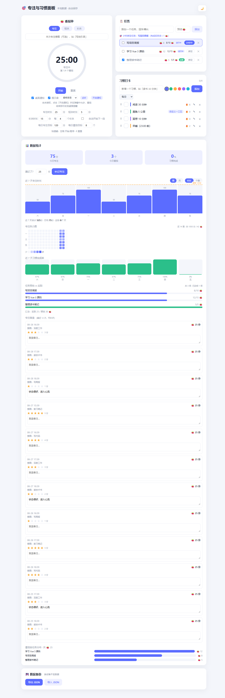

<div align="center">

# 🎯 专注与习惯面板 · Focus & Habit Panel

**一个本地优先的专注计时 + 习惯打卡 + 数据可视化 Web 应用**

零后端 · 数据全存本地 · 支持 PWA 离线安装

[在线演示](https://pythontryer.github.io/tomatoClock/) · [快速开始](#-快速开始) · [功能](#-功能) · [架构](#-架构)


</div>

> 一句话：把番茄钟、习惯打卡、任务管理、数据复盘装进浏览器本地的个人生产力面板，数据全程只留在你自己的设备上。



## ✨ 功能

### 🍅 番茄钟
- 专注 / 短休 / **长休** 三模式，时长均可配置；每完成 N 个番茄自动进入长休息
- 一段结束后可**自动接续**下一段（可关闭）
- SVG 进度环 + 开始 / 暂停 / 重置，键盘快捷键（`空格` / `R`）
- 结束时**桌面通知** + **WebAudio 提示音**（柔和双音 / 钟声 / 木鱼 / 电子 beep 可选，无需音频文件）
- 计时中**标签页标题显示倒计时**；专注时申请 **Wake Lock 屏幕常亮**
- 可设每日专注目标（分钟）与番茄目标（个）
- 专注前可填**意图**，完成后弹**复盘卡**（1–5 星 + 备注），可回看/补评

### ✅ 习惯打卡
- 新增 / 删除 / 重命名，可选颜色，**拖拽排序**
- 支持**自定义频率**（每天 / 每周 N 天 / 指定星期），连续天数**频率感知**（跳过非打卡日不打断 🔥）
- 可设**每日提醒**（应用内 Toast + 桌面通知，同日仅提醒一次）

### 📋 任务（绑定番茄）
- 新增 / 删除 / 勾选完成任务，点「绑定」即可把番茄钟关联到任务
- 每个专注番茄自动给绑定任务 +1 🍅，可设**预估番茄数**，直观对比**实际 vs 预估**

### 📊 数据统计
- 今日 KPI：专注分钟、番茄数、习惯完成率
- **周 / 月趋势图**（专注时长 / 番茄数切换）+ 虚线目标线，达标自动变绿
- **专注热力图**（GitHub 风格，近 14 周按天着色）
- 番茄按任务分布、近 7 天习惯完成率

### 💾 数据备份
- 一键导出 JSON；导入时**字段级校验 + 清洗**，支持**覆盖**或**合并**（按 id 去重、打卡取并集，不丢数据）

### 🌙 其他
- 亮 / 暗色主题一键切换，响应式布局
- **PWA**：可安装到主屏幕 + 离线可用（Service Worker 缓存优先）
- 无障碍：焦点环、`aria-*` 标签、`prefers-reduced-motion` 适配

## 🚀 快速开始

```bash
# 安装依赖
npm install

# 启动开发服务器（自动打开浏览器）
npm run dev

# 类型检查 / 单元测试 / 代码规范
npm run typecheck
npm run test
npm run lint

# 生产构建（产物输出到 docs/，由 GitHub Pages 托管）
npm run build
```

> 桌面通知仅在同源 `localhost` 或 HTTPS 下可用，开发环境天然满足。

## 🛠 技术栈

| 类别 | 选型 |
|---|---|
| 框架 | [Vue 3](https://vuejs.org/)（Composition API + `<script setup>`） |
| 语言 | TypeScript（严格模式，`vue-tsc` 类型检查） |
| 状态管理 | [Pinia](https://pinia.vuejs.org/)（`$subscribe` 深监听自动持久化） |
| 构建 | [Vite](https://vitejs.dev/) + `@/` 路径别名 |
| 测试 | [Vitest](https://vitest.dev/) + [Vue Test Utils](https://test-utils.vuejs.org/)（48 用例） |
| 规范 | [ESLint](https://eslint.org/)（flat config）+ [Prettier](https://prettier.io/) |
| 部署 | GitHub Pages（构建产物 `docs/`，`base: './'` 适配子路径） |

除 Pinia 外**零运行时依赖**：拖拽用原生 HTML5 Drag & Drop，提示音用 WebAudio 合成，图表用 SVG/CSS 手绘，PWA 用原生 Service Worker。

## 📁 目录结构

```
├── tomatoClock/                  # 应用源码
│   ├── src/
│   │   ├── main.ts               # 入口（注册 Pinia + 持久化订阅）
│   │   ├── App.vue               # 仪表盘布局 + 主题切换
│   │   ├── types/                # 领域类型（Habit/Task/Session/Settings…）
│   │   ├── constants/            # 默认设置 / 色板 / 提示音 profile
│   │   ├── stores/               # Pinia 状态 + 领域 actions + 持久化
│   │   ├── composables/          # useTimer / useSound / useNotification / useHabitReminders / useToast
│   │   ├── components/           # PomodoroTimer / TaskBoard / HabitList / StatsPanel / DataManager
│   │   └── utils/                # date / id / importExport / habit / normalize
│   ├── tests/                    # Vitest 单元测试
│   ├── public/                   # 静态资源 + PWA（manifest / sw.js）
│   └── package.json
├── docs/                         # 构建产物（GitHub Pages 部署源）
├── .github/workflows/ci.yml      # CI（typecheck / test / lint / build）
└── README.md
```

## 🏗 架构

```
                    App.vue（仪表盘布局）
   ┌──────────────────────────────────────────────────────┐
   │  PomodoroTimer · TaskBoard · HabitList · StatsPanel  │
   │     ├─ 番茄钟（进度环 / 模式 / 意图 / 复盘）            │
   │     ├─ 任务（绑定番茄 / 预估偏差）                     │
   │     ├─ 习惯（频率 / 连续天数 / 拖拽 / 提醒）            │
   │     └─ 统计（KPI / 趋势 / 热力图 / 任务分布）           │
   ├──────────────────────────────────────────────────────┤
   │  composables：useTimer / useSound / useNotification   │
   │              useHabitReminders / useToast             │
   ├──────────────────────────────────────────────────────┤
   │  Pinia store（useAppStore）—— 领域状态 + 持久化        │
   │  utils：date / id / importExport / habit / normalize  │
   └──────────────────────────────────────────────────────┘
         数据：localStorage（schema 版本迁移 + 备份恢复）
```

- **表现层**（components）只负责渲染与交互；**领域逻辑**收敛在 Pinia store 与 composables，可独立单测。
- 计时核心基于**时间戳锚点**（`endAt = Date.now() + remaining`），后台标签页节流不影响精度。
- 数据采用 **schema 版本化**（`version` 字段），老备份自动归一化迁移、损坏串自动备份回退。

## 📖 English

**Focus & Habit Panel** — a local-first Pomodoro timer + habit tracker + data dashboard web app. No backend, no signup; all data stays in your browser's `localStorage`.

- **Pomodoro** with focus / short / long modes, auto-break rhythm, desktop notifications, WebAudio chimes, title countdown, Wake Lock, intention + reflection.
- **Habits** with custom frequency, streak tracking, drag-sort, colors, and daily reminders.
- **Tasks** bound to pomodoros with estimate vs. actual tracking.
- **Stats** with KPI, weekly/monthly trend + goal line, a GitHub-style 14-week heatmap, and per-task distribution.
- **PWA** installable + offline; dark mode; accessibility support.

Built with **Vue 3 + TypeScript + Pinia + Vite**, tested with **Vitest**, linted with **ESLint/Prettier**. MIT licensed.

## 📄 License

[MIT](./LICENSE) © 2026 The Focus-Habit-Panel Authors
