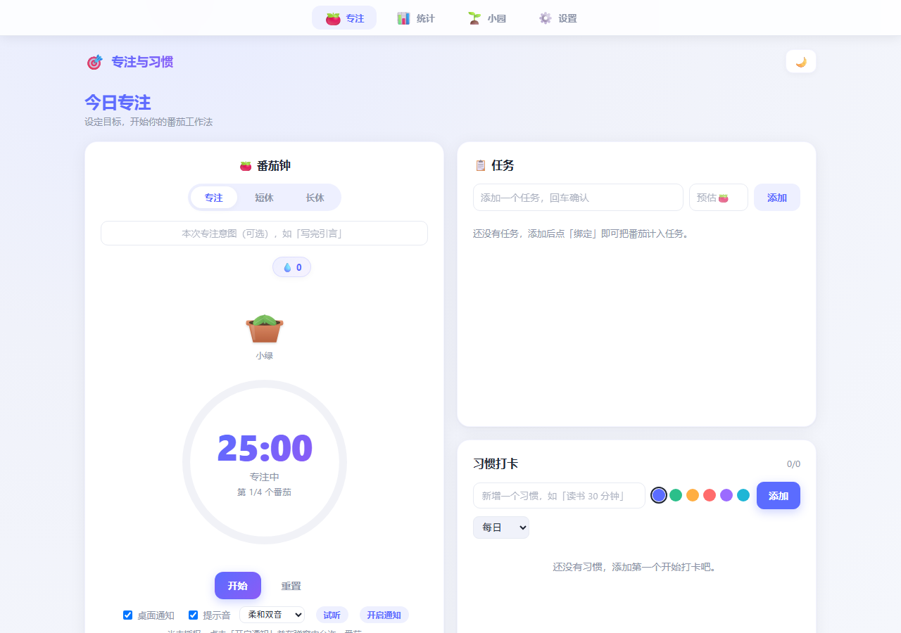
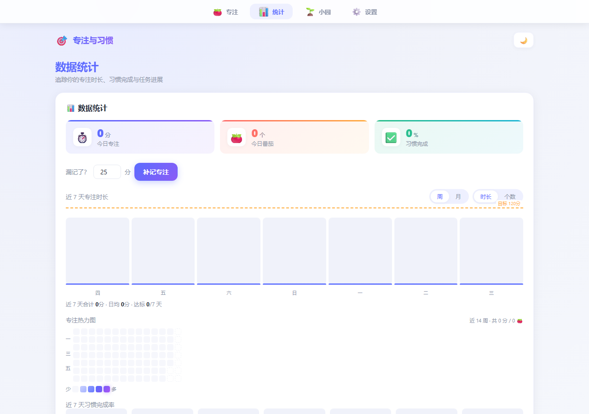
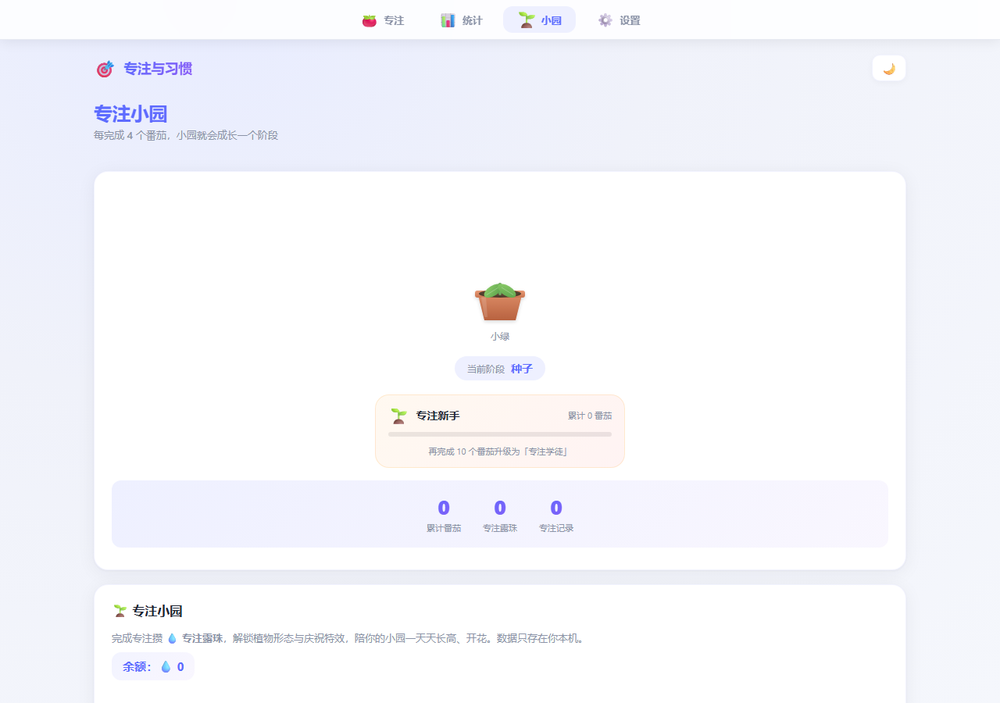
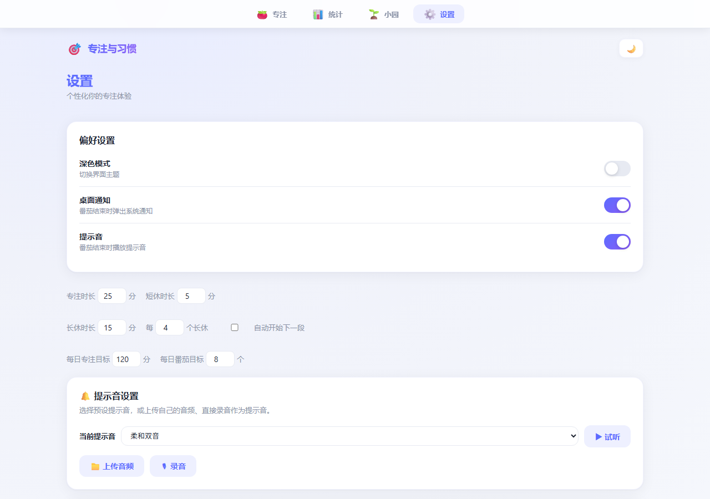

# 🎯 专注与习惯面板

> 一个长在浏览器里的专注小园 —— 每完成 4 个番茄，植物就会成长一个阶段。

本地优先的番茄钟 + 习惯打卡 + 数据统计 Web 应用。纯前端，数据存在浏览器 localStorage，无需后端、注册和联网。

**[立即体验 →](https://pythontryer.github.io/tomatoClock/)**

---

## ✨ 核心特性

### 🍅 番茄钟
- 专注 / 短休 / 长休三模式，时长均可配置
- 每完成 N 个番茄自动进入长休息（N 可设，默认 4）
- 自动开始下一段（可关闭）
- SVG 渐变进度环 + 发光效果
- 结束时桌面通知（自动申请权限）+ 提示音
- **自定义提示音**：上传音频文件或直接录音作为提示音
- 标签页标题显示倒计时，切走标签页也能看进度
- 键盘快捷键：`空格` 开始/暂停、`R` 重置

### 🌱 专注小园（游戏化）
- 每完成 4 个番茄，植物成长一个阶段（种子 → 发芽 → 成长 → 绽放）
- **专注露珠**：完成专注获得，可用于浇水和商店解锁
- **陪伴商店**：解锁不同植物形态和庆祝特效
- **专注等级**：累计番茄数对应等级（新手 → 学徒 → 达人 → 专家 → 大师 → 宗师）
- 点击植物浇水，消耗露珠，植物有即时反馈

### ✅ 习惯打卡
- 新增 / 删除 / 重命名习惯，可选颜色
- 每日一键打卡，自动计算连续天数
- 拖拽排序

### 📋 任务（绑定番茄）
- 新增 / 删除任务，勾选完成
- 点任务「绑定」把番茄钟关联到该任务
- 每完成一个专注番茄，自动给绑定任务 +1

### 📊 数据统计
- 今日 KPI：专注分钟、番茄数、习惯完成率
- 周 / 月视图切换，专注时长 / 番茄数指标切换
- 专注热力图、任务分布、习惯完成率、预估偏差
- 目标线，达标柱子自动变绿

### 💾 数据备份与迁移
- 一键导出全部数据（专注记录、习惯打卡、任务清单、小园成长）
- 导入时严格格式校验，支持覆盖或合并
- 中文文件名：`专注与习惯-备份-YYYY-MM-DD.json`

### 🌙 其他
- 亮 / 暗色主题一键切换
- PWA 可安装 + 离线可用
- 所有数据与设置自动持久化，刷新不丢

---

## 🖼 截图

| 专注页 | 统计页 |
|---|---|
|  |  |
| 小园页 | 设置页 |
|  |  |

---

## 🛠 技术栈

- **Vue 3**（Composition API + `<script setup>` + TypeScript）
- **Vite** + `@/` 路径别名
- **Pinia** 状态管理（类型安全 + 自动持久化）
- **Vue Router** 4（hash 模式，兼容 GitHub Pages）
- **Vitest** + Vue Test Utils 单元测试（93 项测试）
- **ESLint** + **Prettier** 代码规范
- 除 Pinia / Vue Router 外零运行时依赖：拖拽用原生 HTML5，提示音用 WebAudio 合成，图表用 SVG/CSS 手绘，PWA 用原生 Service Worker
- 部署：构建产物输出到 `docs/`，GitHub Pages 托管

---

## 🚀 快速开始

```bash
# 安装依赖
npm install

# 启动开发服务器
npm run dev

# 类型检查 / 单元测试 / 代码规范 / 生产构建
npm run typecheck
npm run test
npm run lint
npm run build
```

> 桌面通知仅在 `localhost` 或 HTTPS 下可用；录音功能需要 HTTPS 或 localhost。

---

## 📁 目录结构

```
├── index.html
├── vite.config.ts
├── src/
│   ├── main.ts               # 入口（注册 Pinia + Router）
│   ├── style.css             # 全局样式 + 主题变量
│   ├── App.vue               # 路由出口 + 顶部品牌栏
│   ├── router/index.ts       # 4 个 hash 路由
│   ├── views/                # FocusView / StatsView / GardenView / SettingsView
│   ├── components/
│   │   ├── PomodoroTimer.vue # 番茄钟
│   │   ├── Companion.vue     # 植物 SVG
│   │   ├── CompanionShop.vue # 陪伴商店
│   │   ├── SoundCustomizer.vue # 自定义提示音（上传+录音）
│   │   ├── BottomNav.vue     # 顶部导航栏
│   │   ├── stats/            # 5 个统计图表组件
│   │   └── DataManager.vue   # 数据导出/导入
│   ├── stores/useAppStore.ts # Pinia 状态
│   ├── composables/          # useTimer / useSound / useNotification
│   └── constants/index.ts    # 默认设置、植物成长、专注等级
└── tests/                    # Vitest 单元测试
```

---

## 🔒 隐私说明

- **所有数据存储在你的浏览器 localStorage 中**，不会上传到任何服务器
- 不需要注册、不需要登录、不需要联网
- 录音功能仅在本地使用，录制的音频保存在浏览器中
- 换设备时用「导出备份 → 导入备份」迁移数据

---

## 📄 License

MIT
